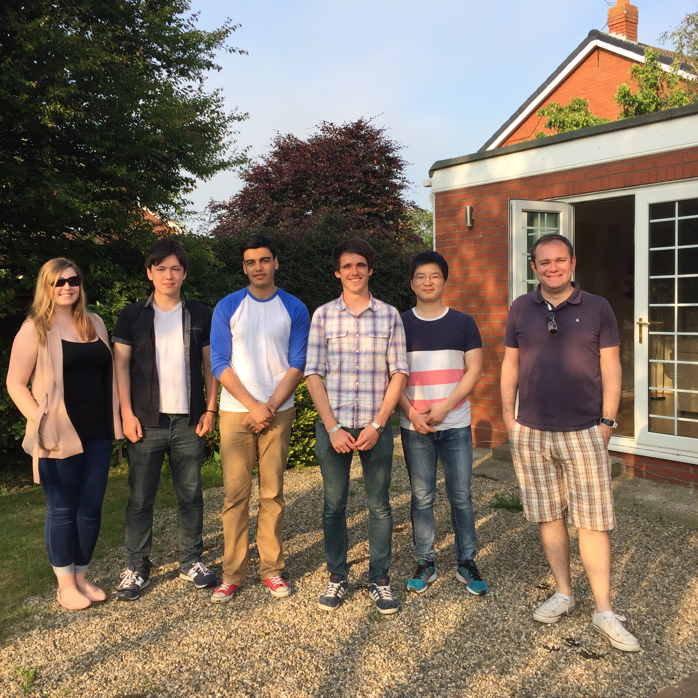

# Home

Welcome to the homepage for Kenneth Kazuya Inglis.  
インガルス　ケネス　和哉です。

I am currently a PhD student at the University of Liverpool working under the supervision of 
Dr. Frédéric Blanc and Prof. Matthew J. Rosseinsky.

My PhD project focuses on structure and dynamics investigation of fast solid state Li ion conducting 
materials using Solid State NMR.　　

現在リバプール大学でRosseinsky教授とBlanc博士の元で博士号を勉強しています。
リチウムイオン電池の個体イオン伝導体を核磁気共鳴(NMR)を使って研究しています。

